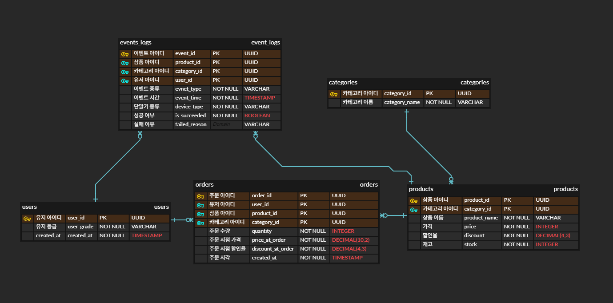
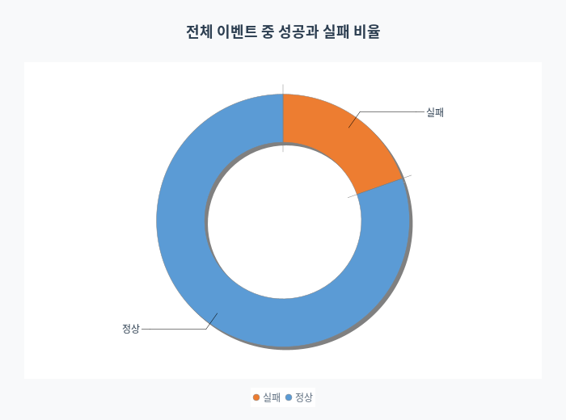
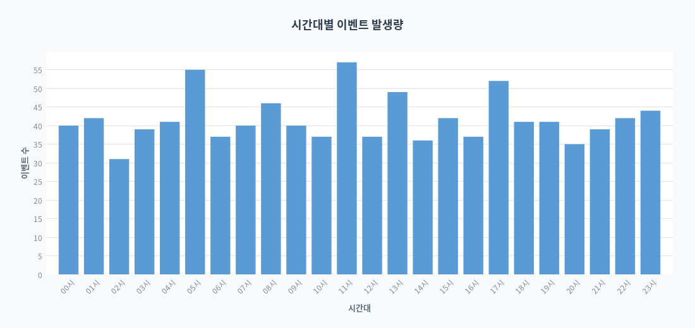
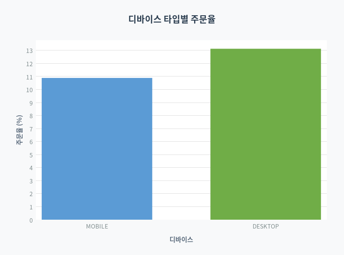
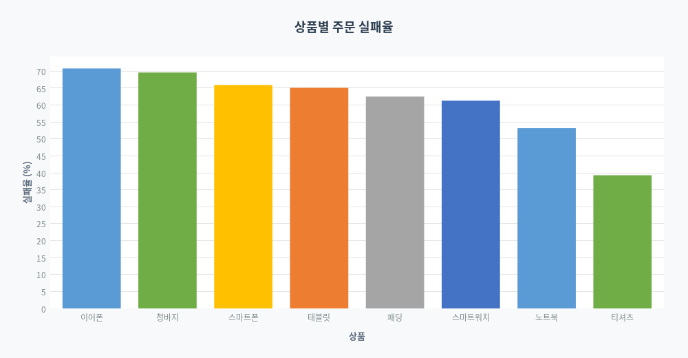
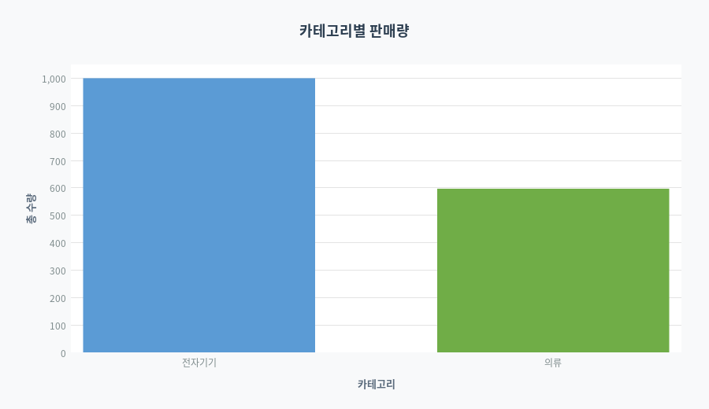

# Event Log Pipeline

웹 서비스에서 발생하는 이벤트를 생성하고, 저장하고, 분석하는 파이프라인입니다.

## 실행 방법

### 사전 요구사항
- [Git](https://git-scm.com/downloads) 설치
- [Docker Desktop](https://www.docker.com/products/docker-desktop/) 설치
- WSL2 설치 (Windows 전용)
  - 터미널(명령 프롬프트 또는 PowerShell)을 **관리자 권한**으로 열고 실행:
`wsl --install`

### 실행
- 먼저 Docker Desktop 실행 후 CMD 창에 아래와 같은 명령어 입력

```bash
git clone https://github.com/chaoskyj1120/event-log-pipeline.git
cd event-log-pipeline
docker-compose up --build
```

실행 시 PostgreSQL DB와 Spring Boot 앱이 함께 시작되며, 앱 시작 직후 EventGenerator가 자동으로 1000건의 이벤트를 생성하고 저장합니다.  
이미 데이터가 존재하면 이벤트 생성을 건너뜁니다.

### 데이터 초기화 후 재실행

```bash
docker-compose down -v
docker-compose up --build
```

---

## Step 1. 이벤트 생성기 작성

### 이벤트 타입

| 이벤트 | 설명 |
|---|---|
| `LOGIN` | 사용자 로그인 |
| `PAGE_VIEW` | 상품 상세 페이지 조회 |
| `ORDER_CREATED` | 주문 성공 |
| `ORDER_FAILED` | 주문 실패 (재고 부족) |

### 설계 이유

실제 이커머스 서비스에서 발생하는 사용자 행동 흐름을 기반으로 설계했습니다.

- **LOGIN**: 사용자 활동의 시작점으로, 시간대별 접속 패턴과 디바이스 분포를 분석합니다.
- **PAGE_VIEW**: 상품 조회 후 실제 구매로 이어지는 전환율을 파악하기 위해 포함했습니다.
- **ORDER_CREATED / ORDER_FAILED**: 주문 성공과 실패를 구분하여 재고 부족 같은 운영 이슈를 탐지합니다. 실패 이벤트는 트랜잭션이 롤백되더라도 독립적으로 기록됩니다(`Propagation.REQUIRES_NEW`).

### 이벤트 생성 방식

Java로 작성된 `EventGenerator`가 앱 시작 시 1000건의 이벤트를 REST API HTTP 요청으로 생성합니다. 직접 서비스를 호출하지 않고 REST API를 통해 이벤트를 생성함으로써 실제 서비스 흐름 전체(직렬화, 유효성 검사, 라우팅)를 검증합니다.

```
EventGenerator → POST /users/login      → LOGIN 이벤트 기록
              → GET  /products/{id}    → PAGE_VIEW 이벤트 기록
              → POST /orders           → ORDER_CREATED 또는 ORDER_FAILED 이벤트 기록
```

### 초기 데이터

- 유저 10명: BRONZE 4명, SILVER 3명, GOLD 3명
- 상품 8개: 전자기기 5개 (노트북, 스마트폰, 이어폰, 태블릿, 스마트워치), 의류 3개 (티셔츠, 청바지, 패딩)
- 디바이스 타입: MOBILE, DESKTOP
- 주문 수량: 1 ~ 30개 (랜덤)
- 이벤트 시각: 최근 30일 이내 랜덤
- 상품 재고: 200개
---

## Step 2. 로그 저장

### ERD



### 저장소 선택: PostgreSQL

**선택 이유**

이벤트 로그는 사용자, 상품, 주문과 **관계**를 가지는 정형 데이터입니다. 관계형 DB가 가장 적합하다고 생각합니다.  
시간대별, 유저별, 디바이스별 집계와 같은 **복잡한 분석 쿼리**를 SQL로 직관적으로 작성할 수 있으며, 인덱스를 활용한 빠른 조회가 가능합니다.

### 스키마

**event_logs**

이벤트 파이프라인의 핵심 테이블입니다. 모든 사용자 행동(로그인, 조회, 주문)을 단일 테이블에 기록하여 이벤트 타입별·시간대별·디바이스별 통합 분석이 가능합니다. `product_id`를 nullable로 설계해 상품과 무관한 LOGIN 이벤트도 동일한 구조로 저장합니다.

| 컬럼 | 타입 | 설명 | 인덱스 |
|---|---|---|---|
| event_id | UUID | PK | |
| user_id | UUID | FK → users (NOT NULL) | 유저별 이벤트 조회 및 집계 |
| event_type | VARCHAR(50) | LOGIN / PAGE_VIEW / ORDER_CREATED / ORDER_FAILED | 이벤트 타입별 필터링 및 집계 |
| event_time | TIMESTAMP | 이벤트 발생 시각 | 시간대별, 요일별 범위 조회 |
| product_id | UUID | FK → products (nullable) | 상품별 조회수 대비 구매 비율 분석 |
| device_type | VARCHAR(20) | MOBILE / DESKTOP | |
| is_succeeded | BOOLEAN | 이벤트 성공 여부 (기본값 true) | |
| failed_reason | VARCHAR(20) | 실패 원인 (nullable) | |

**users**

등급(BRONZE / SILVER / GOLD) 기반의 구매력 분석과 재구매 유저 비율 분석에 사용됩니다. 분석에 필요한 최소한의 컬럼만 유지해 단순하게 설계했습니다.

| 컬럼 | 타입 | 설명 |
|---|---|---|
| user_id | UUID | PK |
| user_grade | VARCHAR(10) | BRONZE / SILVER / GOLD |
| created_at | TIMESTAMP | 가입 시각 |

**products**

상품별 매출·판매량·주문 실패율 분석의 기준이 되는 테이블입니다. `price`와 `discount`를 분리 저장하여 주문 시점의 실제 결제 금액을 orders 테이블에서 별도로 추적할 수 있도록 했습니다. `stock`은 ORDER_FAILED(재고 부족) 이벤트 발생의 기준이 됩니다.

| 컬럼 | 타입 | 설명 | 인덱스 |
|---|---|---|---|
| product_id | UUID | PK | |
| product_name | VARCHAR(255) | 상품명 | |
| category_id | UUID | FK → categories | 카테고리별 상품 조회 |
| price | INTEGER | 정가 | 가격 범위 필터링 |
| discount | DECIMAL(4,3) | 할인율 | 할인율 기준 정렬 및 필터링 |
| stock | INTEGER | 재고 수량 (NOT NULL) | |

**orders**

주문 성공(ORDER_CREATED) 시점의 가격과 할인율을 `price_at_order`, `discount_at_order`로 스냅샷 저장합니다. 이후 상품 가격이 변경되더라도 주문 당시의 정확한 매출을 계산할 수 있도록 하기 위해서입니다.

| 컬럼 | 타입 | 설명 | 인덱스 |
|---|---|---|---|
| order_id | UUID | PK | |
| user_id | UUID | FK → users (NOT NULL) | 유저별 주문 내역 조회 및 재구매 유저 분석 |
| product_id | UUID | FK → products (NOT NULL) | 상품별 주문 수량 집계 |
| quantity | INTEGER | 주문 수량 (NOT NULL) | |
| price_at_order | DECIMAL(10,2) | 주문 시점 가격 | |
| discount_at_order | DECIMAL(4,3) | 주문 시점 할인율 | |
| created_at | TIMESTAMP | 주문 시각 | |

**categories**

상품을 전자기기·의류 등으로 분류하여 카테고리별 판매량 분석에 활용합니다. products 테이블과 분리하여 카테고리명 변경 시 products를 수정하지 않아도 되도록 설계했습니다.

| 컬럼 | 타입 | 설명 |
|---|---|---|
| category_id | UUID | PK |
| category_name | VARCHAR(255) | 카테고리명 |

---

## Step 3. 데이터 집계 분석

`analytics.sql` 파일에 차트 생성에 사용되는 11개의 분석 쿼리를 작성했습니다.

| 번호 | 분석 항목 |
|---|---|
| 1 | 이벤트 타입별 발생 횟수 |
| 2 | 전체 이벤트 중 성공과 실패 비율 |
| 3 | 시간대별 이벤트 발생량 |
| 4 | 디바이스 타입별 주문율 |
| 5 | 카테고리별 판매량 |
| 6 | 상품별 총 매출 |
| 7 | 상품별 주문 실패율 |
| 8 | 할인율 구간별 구매량 |
| 9 | 할인율별 구매량 |
| 10 | 가격별 구매량 |
| 11 | 유저 등급별 디바이스 선호도 |

### ChartService

`ChartService`는 위 쿼리를 실행하고 그 결과를 JFreeChart 라이브러리를 사용해 PNG 차트 이미지로 저장합니다.  
앱 시작 시 `ChartScheduler`가 `ChartService.generateAll()`을 호출하여 11개의 차트를 자동으로 생성합니다.  
생성된 이미지는 `images/charts/` 디렉토리에 저장됩니다.

| 차트 파일 | 설명 | 차트 종류 |
|---|---|---|
| `event_type_count.png` | 이벤트 타입별 발생 횟수 | 막대 차트 |
| `success_fail_ratio.png` | 전체 이벤트 중 성공과 실패 비율 | 도넛 차트 |
| `hourly_events.png` | 시간대별 이벤트 발생량 | 막대 차트 |
| `device_order_rate.png` | 디바이스 타입별 주문율 | 막대 차트 |
| `category_sales.png` | 카테고리별 판매량 | 막대 차트 |
| `product_revenue.png` | 상품별 총 매출 | 막대 차트 |
| `product_fail_rate.png` | 상품별 주문 실패율 | 막대 차트 |
| `discount_range_quantity.png` | 할인율 구간별 구매량 | 막대 차트 |
| `discount_rate_quantity.png` | 할인율별 구매량 | 막대 차트 |
| `price_range_quantity.png` | 가격별 구매량 | 막대 차트 |
| `grade_device.png` | 유저 등급별 디바이스 선호도 | 그룹 막대 차트 |

---

## Step 4. Docker로 실행 가능하게 만들기

`docker-compose.yml`을 작성하여 `docker-compose up --build` 한 번으로 전체 스택이 실행되도록 구성했습니다.

- **앱 + DB 함께 구성**: PostgreSQL 컨테이너와 Spring Boot 앱 컨테이너를 함께 정의했습니다.
- **이벤트 생성 → 저장 자동화**: 앱 시작 직후 `EventGenerator`가 자동으로 실행되어 1000건의 이벤트를 생성하고 저장합니다.

---

## Step 5. 결과 시각화

`ChartService`가 생성한 차트 이미지 예시입니다.

**전체 이벤트 중 성공과 실패 비율**
전체 이벤트 중 정상 처리된 이벤트와 실패한 이벤트의 비율을 나타냅니다.


**시간대별 이벤트 발생량**
0시부터 23시까지 시간대별로 이벤트가 얼마나 발생했는지 파악합니다.


**디바이스 타입별 주문율**
MOBILE과 DESKTOP 각 디바이스에서 발생한 주문 비율을 비교합니다.


**상품별 주문 실패율**
상품별로 주문 시도 대비 실패 비율을 파악합니다.


**카테고리별 판매량**
전자기기와 의류 카테고리별 총 판매 수량을 비교합니다.


---

## 선택 A. Kubernetes 배포 설정

`k8s/` 디렉토리에 Kubernetes에 배포하기 위한 manifest 파일을 작성했습니다.

```
k8s/
├── secret.yaml      # DB 접속 자격증명
├── deployment.yaml  # 앱 배포 설정
└── service.yaml     # 앱 네트워크 노출
```

### 리소스 역할

**Secret** (`secret.yaml`)

DB 접속에 필요한 사용자명과 비밀번호를 저장합니다. 평문으로 환경변수에 노출하지 않고 Secret으로 분리하여 `deployment.yaml`에서 참조합니다.

```yaml
stringData:
  db-username: event_log_pipeline_user
  db-password: "000000"
```

**Deployment** (`deployment.yaml`)

이벤트 생성기(EventGenerator)를 포함한 Spring Boot 앱의 배포 방식을 정의합니다. 주요 설정은 아래와 같습니다.

- **replicas: 3** — 파드를 3개 동시에 실행합니다. Service가 3개의 파드에 트래픽을 균등하게 분산하여 로드 밸런싱을 구현합니다. 파드 1개가 장애가 나도 나머지 2개가 요청을 계속 처리합니다.
- **resources** — 각 파드의 CPU와 메모리 사용량을 제한합니다. 파드가 여러 개 실행될 때 한 파드가 서버 자원을 독점하는 것을 방지합니다.
  - `requests`: 파드 실행에 보장되는 최소 자원 (CPU 250m, 메모리 512Mi)
  - `limits`: 파드가 사용할 수 있는 최대 자원 (CPU 500m, 메모리 1Gi)
- **env** — DB 접속 정보를 Secret에서 참조하여 주입합니다.

```
요청
  ↓
Service
  ├── 파드 1 (Spring Boot + EventGenerator)
  ├── 파드 2 (Spring Boot + EventGenerator)
  └── 파드 3 (Spring Boot + EventGenerator)
```

**Service** (`service.yaml`)

Deployment가 생성한 파드에 고정된 네트워크 주소를 부여합니다. 파드는 재시작될 때마다 IP가 바뀌지만, Service 이름(`event-log-pipeline-service`)으로 항상 동일하게 접근할 수 있습니다. 내부적으로 살아있는 파드에만 트래픽을 전달하므로, 장애 파드로 요청이 가는 것을 방지합니다.

### 리소스 선택 이유

| 리소스 | 선택 이유 |
|---|---|
| Secret | DB 비밀번호를 코드나 환경변수에 평문으로 노출하지 않기 위해 |
| Deployment | 파드 3개로 로드 밸런싱, 장애 시 자동 재시작, 무중단 롤링 배포를 위해 |
| Service | 파드 IP는 재시작마다 바뀌므로, 고정 엔드포인트와 트래픽 분산을 위해 |

---

## 선택 B. AWS 아키텍처 설계

### EC2 + ECS


| AWS 서비스 | 역할 |
|---|---|
| ECR | Docker 이미지 저장소 |
| EC2 | 앱이 실행되는 서버 |
| ECS Cluster | EC2 위에서 컨테이너 오케스트레이션 |
| ECS Service | Task 수 유지 및 자동 재시작 관리 |
| RDS | 관리형 PostgreSQL |
| S3 | 차트 이미지 저장 |

---

## 구현하면서 고민한 점

### ORDER_FAILED 이벤트를 별도 트랜잭션으로 분리

주문 실패(재고 부족) 시 주문 트랜잭션은 롤백되어야 하지만, ORDER_FAILED 이벤트 기록은 남아야 합니다. 처음엔 같은 트랜잭션에 넣었다가 롤백 시 이벤트도 함께 사라지는 문제를 발견했습니다. `logFailure()`에 `Propagation.REQUIRES_NEW`를 적용해 주문 트랜잭션과 완전히 독립된 트랜잭션으로 이벤트를 저장하도록 해결했습니다.

### EventGenerator를 서비스 직접 호출 대신 REST API HTTP 요청으로 구현

처음에는 `OrderService.createOrder()`를 직접 호출하는 방식을 생각했습니다. 하지만 이 방식은 컨트롤러·직렬화·유효성 검사 등 실제 서비스 흐름을 건너뛰기 때문에, 실제 운영 환경과 동일한 경로로 이벤트를 만들고 싶었습니다. `RestTemplate`으로 HTTP 요청을 직접 보내는 방식으로 바꿔 전체 스택이 정상 동작하는지까지 함께 검증할 수 있었습니다.

### 재고 감소에 비관적 락 적용
`EventGenerator`가 1000건의 주문 요청을 빠르게 전송하면, 여러 트랜잭션이 동시에 같은 상품의 재고를 수정하게 됩니다. 이는 실제 이커머스에서도 흔히 발생하는 문제입니다. 인기 상품의 한정 수량 특가 판매처럼 수천 명이 동시에 주문 버튼을 누르는 상황에서, 동시성 제어 없이 구현하면 재고 5개짜리 상품이 50개 팔리는 일이 실제로 발생할 것입니다.

이를 해결하기 위해 상품 레포지터리에 `findByIdWithLock()`으로 비관적 락을 적용해, 한 트랜잭션이 재고를 수정하는 동안 다른 트랜잭션은 대기하도록 구현했습니다.

### ChartService에서 JPA 대신 JdbcTemplate 사용

집계 쿼리를 JPA로 작성하면 JPQL이나 Criteria API를 써야 하는데, `CASE WHEN`, `WINDOW FUNCTION`, 여러 테이블 JOIN이 얽힌 쿼리는 코드가 너무 복잡해졌습니다. 어차피 읽기 전용 분석 쿼리이므로 `JdbcTemplate`으로 SQL을 직접 작성하는 게 훨씬 명확하다고 판단했습니다.

### 이벤트 드리븐 아키텍처 도입을 검토했지만 적용하지 않은 이유

Kafka 같은 메시지 브로커를 도입해 이벤트를 비동기로 처리하는 구조를 고민했습니다. 이벤트 생산과 소비를 분리하면 서비스 간 결합도를 낮출 수 있고, 트래픽이 몰릴 때 이벤트를 큐에 쌓아 처리 속도를 조절할 수 있다는 장점이 있습니다.

하지만 이 프로젝트의 규모에서는 오히려 복잡도만 높인다고 판단했습니다. Kafka 클러스터 구성·운영, 메시지 직렬화, 컨슈머 그룹 관리 등 부가적인 인프라 비용이 발생하는 반면, 1000건의 이벤트를 단일 앱에서 동기로 처리하는 데 성능 문제가 없었습니다. 이벤트 드리븐은 서비스가 분리되거나 처리량이 현재보다 훨씬 커질 때 도입하는 것이 적절하다고 결론 내렸습니다.
